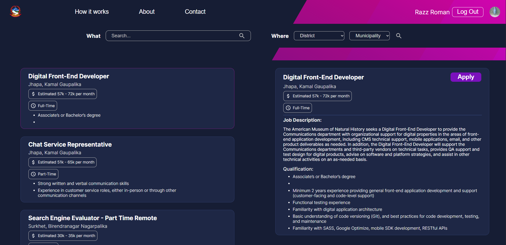

[<h1 style="font-size:60px; width:100%;">HamroRojgar</h1>](./appIcon.ico)

# 🤝 Where you can apply for the desired jobs opened by every governments & it's organization. 🤝

## Technology Stack:
| Technology   | Description  |
| ------------ | ------------ |
| NextJS       | Client Side  |
| Django & DRF | Backend API  |
| PostgreSQL   | SQL Database |

## Main Feature:  
- Every government & it's organization will have their own email & password to logged in as admin
- Governments can open a new vacancy by themselves from the admin site
- Government like federal government, province government, local government as well as government organizations like: government school etc..., have their admin site to get access where Federal government have an access to all the control where as other government have only access to certain areas
- Citizen can new search the desired jobs as per their qualifications and then apply it
- added Minimum charge of rs.20 and used Khalti: https://khalti.com/ as a payment gateway.
- Added Email Verification as well where after government approved the job application those citizen that get approved will get emailed as congratulation message
- Customized Django Admin panel.

### Home Page:
[</img>](./assets/ui/home.png)

### Registration Page:
[</img>](./assets/ui/register.png)

### Login Page:
[</img>](./assets/ui/login.png)

### Find Jobs Page :
[</img>](./assets/ui/find_job.png)

### Apply for Job Page:
[</img>](./assets/ui/apply.png)

### Admin Page for List of Vacancy:
[</img>](./assets/ui/admin_vacancy.png)